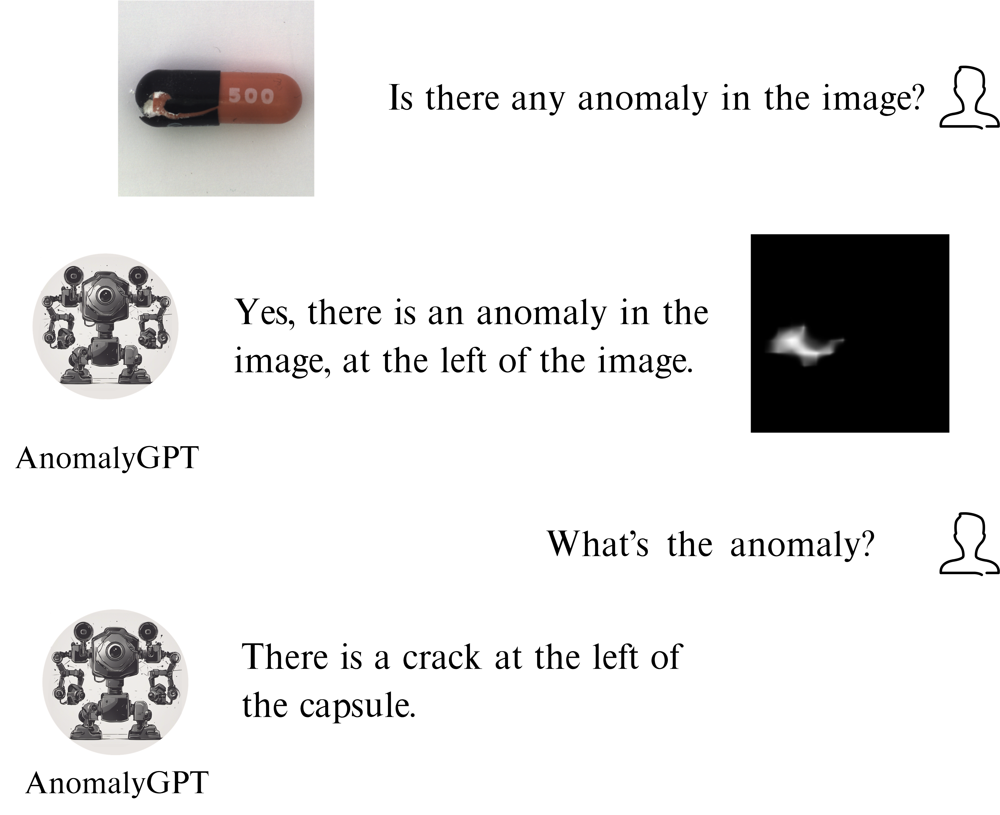
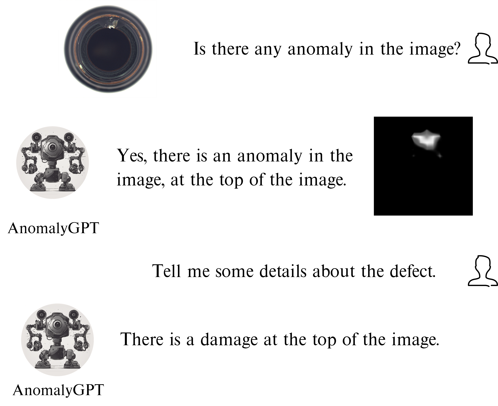
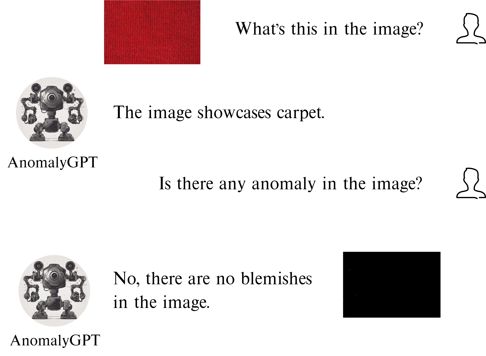
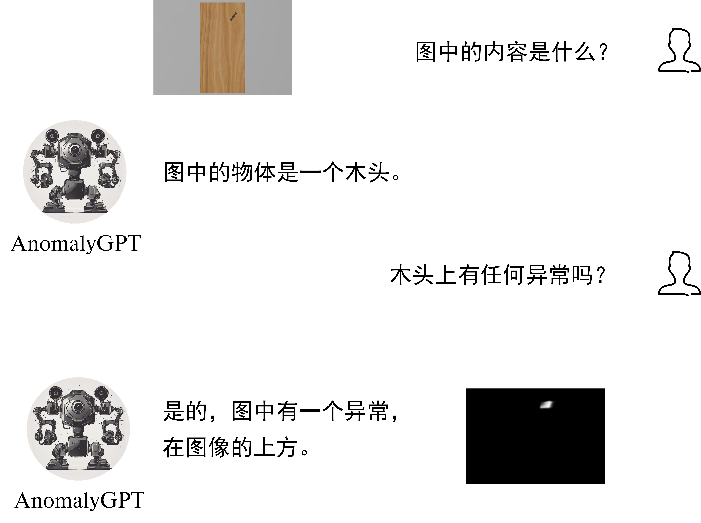
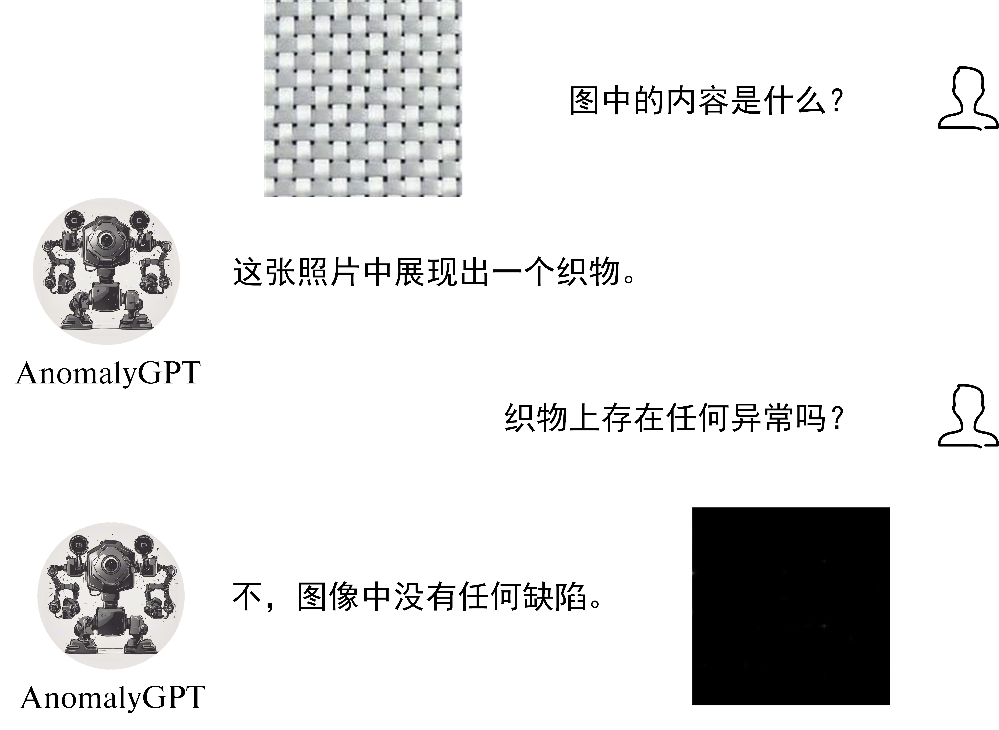

<p align="center" width="100%">

</p>

# AnomalyGPT: Detecting Industrial Anomalies using Large Vision-Language Models


<p align="left">
   🌐 <a href="https://anomalygpt.github.io" target="_blank">Project Page</a> • 🤗 <a href="https://huggingface.co/spaces/FantasticGNU/AnomalyGPT" target="_blank">Online Demo</a> • 📃 <a href="https://arxiv.org/abs/2308.15366" target="_blank">Paper</a> • 🤖 <a href="https://huggingface.co/FantasticGNU/AnomalyGPT" target="_blank">Model</a> • 📹 <a href="https://www.youtube.com/watch?v=lcxBfy0YnNA" target="_blank">Video</a>
</p>


Zhaopeng Gu, Bingke Zhu, Guibo Zhu, Yingying Chen, Ming Tang, Jinqiao Wang


****

<span id='all_catelogue'/>

## Catalogue:

* <a href='#introduction'>1. Introduction</a>
* <a href='#environment'>2. Running AnomalyGPT Demo</a>
    * <a href='#install_environment'>2.1 Environment Installation</a>
    * <a href='#download_imagebind_model'>2.2 Prepare ImageBind Checkpoint</a>
    * <a href='#download_vicuna_model'>2.3 Prepare Vicuna Checkpoint</a>
    * <a href='#download_anomalygpt'>2.4 Prepare Delta Weights of AnomalyGPT</a>
    * <a href='#running_demo'>2.5 Deploying Demo</a>
* <a href='#train_anomalygpt'>3. Train Your Own AnomalyGPT</a>
    * <a href='#data_preparation'>3.1 Data Preparation</a>
    * <a href='#training_configurations'>3.2 Training Configurations</a>
    * <a href='#model_training'>3.3 Training AnoamlyGPT</a>

* <a href='#examples'>4. Examples</a>
<!-- * <a href='#results'>5. Results</a> -->
* <a href='#license'>License</a>
* <a href='#citation'>Citation</a>
* <a href='#acknowledgments'>Acknowledgments</a>

****

<span id='introduction'/>

### 1. Introduction: <a href='#all_catelogue'>[Back to Top]</a>


<p align="center" width="100%">

</p>

**AnomalyGPT** is the first Large Vision-Language Model (LVLM) based Industrial Anomaly Detection (IAD) method that can detect anomalies in industrial images without the need for manually specified thresholds. Existing IAD methods can only provide anomaly scores and need manually threshold setting, while existing LVLMs cannot detect anomalies in the image. AnomalyGPT can not only indicate the presence and location of anomaly but also provide information about the image.


We leverage a pre-trained image encoder and a Large Language Model (LLM) to align IAD images and their corresponding textual descriptions via simulated anomaly data. We employ a lightweight, visual-textual feature-matching-based image decoder to obtain localization result, and design a prompt learner to provide fine-grained semantic to LLM and fine-tune the LVLM using prompt embeddings. Our method can also detect anomalies for previously unseen items with few normal sample provided.  


****

<span id='environment'/>

### 2. Running AnomalyGPT Demo <a href='#all_catelogue'>[Back to Top]</a>

<span id='install_environment'/>

#### 2.1 Environment Installation

Clone the repository locally:

```
git clone https://github.com/CASIA-IVA-Lab/AnomalyGPT.git
```

Install the required packages:

```
pip install -r requirements.txt
```

<span id='download_imagebind_model'/>

#### 2.2 Prepare ImageBind Checkpoint:

You can download the pre-trained ImageBind model using [this link](https://dl.fbaipublicfiles.com/imagebind/imagebind_huge.pth). After downloading, put the downloaded file (imagebind_huge.pth) in [[./pretrained_ckpt/imagebind_ckpt/]](./pretrained_ckpt/imagebind_ckpt/) directory. 

<span id='download_vicuna_model'/>

#### 2.3 Prepare Vicuna Checkpoint:

To prepare the pre-trained Vicuna model, please follow the instructions provided [[here]](./pretrained_ckpt#1-prepare-vicuna-checkpoint).

<span id='download_anomalygpt'/>

#### 2.4 Prepare Delta Weights of AnomalyGPT:

We use the pre-trained parameters from [PandaGPT](https://github.com/yxuansu/PandaGPT) to initialize our model. You can get the weights of PandaGPT trained with different strategies in the table below. In our experiments and online demo, we use the Vicuna-7B and `openllmplayground/pandagpt_7b_max_len_1024` due to the limitation of computation resource. Better results are expected if switching to Vicuna-13B.

| **Base Language Model** | **Maximum Sequence Length** |            **Huggingface Delta Weights Address**             |
| :---------------------: | :-------------------------: | :----------------------------------------------------------: |
|  Vicuna-7B (version 0)  |             512             | [openllmplayground/pandagpt_7b_max_len_512](https://huggingface.co/openllmplayground/pandagpt_7b_max_len_512) |
|  Vicuna-7B (version 0)  |            1024             | [openllmplayground/pandagpt_7b_max_len_1024](https://huggingface.co/openllmplayground/pandagpt_7b_max_len_1024) |
| Vicuna-13B (version 0)  |             256             | [openllmplayground/pandagpt_13b_max_len_256](https://huggingface.co/openllmplayground/pandagpt_13b_max_len_256) |
| Vicuna-13B (version 0)  |             400             | [openllmplayground/pandagpt_13b_max_len_400](https://huggingface.co/openllmplayground/pandagpt_13b_max_len_400) |

Please put the downloaded 7B/13B delta weights file (pytorch_model.pt) in the [./pretrained_ckpt/pandagpt_ckpt/7b/](./pretrained_ckpt/pandagpt_ckpt/7b/) or [./pretrained_ckpt/pandagpt_ckpt/13b/](./pretrained_ckpt/pandagpt_ckpt/13b/) directory. 

After that, you can download AnomalyGPT weights from the table below.

|                     Setup and Datasets                      | Weights Address |
| :---------------------------------------------------------: | :-------------------------------: |
|                  Unsupervised on MVTec-AD                   |          [AnomalyGPT/train_mvtec](https://huggingface.co/FantasticGNU/AnomalyGPT/blob/main/train_mvtec/pytorch_model.pt)           |
|                    Unsupervised on VisA                     |          [AnomalyGPT/train_visa](https://huggingface.co/FantasticGNU/AnomalyGPT/blob/main/train_visa/pytorch_model.pt)           |
| Supervised on MVTec-AD, VisA, MVTec-LOCO-AD and CrackForest |          [AnomalyGPT/train_supervised](https://huggingface.co/FantasticGNU/AnomalyGPT/blob/main/train_supervised/pytorch_model.pt)           |

After downloading, put the AnomalyGPT weights in the [./code/ckpt/](./code/ckpt/) directory.

In our [online demo](https://huggingface.co/spaces/FantasticGNU/AnomalyGPT), we use the supervised setting as our default model to attain an enhanced user experience. You can also try other weights locally.

<span id='running_demo'/>

#### 2.5. Deploying Demo

Upon completion of previous steps, you can run the demo locally as
```bash
cd ./code/
python web_demo.py
```

****

<span id='train_anomalygpt'/>

### 3. Train Your Own AnomalyGPT  <a href='#all_catelogue'>[Back to Top]</a>

**Prerequisites:** Before training the model, making sure the environment is properly installed and the checkpoints of ImageBind, Vicuna and PandaGPT are downloaded. 

<span id='data_preparation'/>

#### 3.1 Data Preparation:

You can download MVTec-AD dataset from [[this link]](https://www.mvtec.com/company/research/datasets/mvtec-ad/downloads) and VisA from [[this link]](https://github.com/amazon-science/spot-diff). You can also download pre-training data of PandaGPT from [[here]](https://huggingface.co/datasets/openllmplayground/pandagpt_visual_instruction_dataset/tree/main). After downloading, put the data in the [[./data]](./data/) directory.

The directory of [[./data]](./data/) should look like:

```
data
|---pandagpt4_visual_instruction_data.json
|---images
|-----|-- ...
|---mvtec_anomaly_detection
|-----|-- bottle
|-----|-----|----- ground_truth
|-----|-----|----- test
|-----|-----|----- train
|-----|-- capsule
|-----|-- ...
|----VisA
|-----|-- split_csv
|-----|-----|--- 1cls.csv
|-----|-----|--- ...
|-----|-- candle
|-----|-----|--- Data
|-----|-----|-----|----- Images
|-----|-----|-----|--------|------ Anomaly 
|-----|-----|-----|--------|------ Normal 
|-----|-----|-----|----- Masks
|-----|-----|-----|--------|------ Anomaly 
|-----|-----|--- image_anno.csv
|-----|-- capsules
|-----|-----|----- ...
```


<span id='training_configurations'/>

#### 3.2 Training Configurations

The table below show the training hyperparameters used in our experiments. The hyperparameters are selected based on the constrain of our computational resources, i.e. 2 x RTX3090 GPUs.

| **Base Language Model** | **Epoch Number** | **Batch Size** | **Learning Rate** | **Maximum Length** |
| :---------------------: | :--------------: | :------------: | :---------------: | :----------------: |
|        Vicuna-7B        |        50        |       16       |       1e-3        |        1024        |


<span id='model_training'/>

#### 3.3 Training AnomalyGPT

To train AnomalyGPT on MVTec-AD dataset, please run the following commands:
```yaml
cd ./code
bash ./scripts/train_mvtec.sh
```

The key arguments of the training script are as follows:
* `--data_path`: The data path for the json file `pandagpt4_visual_instruction_data.json`.
* `--image_root_path`: The root path for training images of PandaGPT.
* `--imagebind_ckpt_path`: The path of ImageBind checkpoint.
* `--vicuna_ckpt_path`: The directory that saves the pre-trained Vicuna checkpoints.
* `--max_tgt_len`: The maximum sequence length of training instances.
* `--save_path`: The directory which saves the trained delta weights. This directory will be automatically created.
* `--log_path`: The directory which saves the log. This directory will be automatically created.

Note that the epoch number can be set in the `epochs` argument at [./code/config/openllama_peft.yaml](./code/config/openllama_peft.yaml) file and the learning rate can be set in  [./code/dsconfig/openllama_peft_stage_1.json](./code/dsconfig/openllama_peft_stage_1.json)


****

<span id='examples'/>

### 4. Examples


<h4 align='center'>An image of concrete with crack. </h4>

****

<h4 align='center'>A crack capsule. </h4>

****

<h4 align='center'>An image of a cut hazelnut. </h4>

****

<h4 align='center'>A damaged bottle. </h4>

****

<h4 align='center'>A photo of normal carpet. </h4>

****

<h4 align='center'>A photo of a piece of wood with defect. </h4>

****

<h4 align='center'>A piece of normal fabric. </h4>


****

<span id='license'/>

### License

AnomalyGPT is licensed under the [CC BY-NC-SA 4.0 license](./LICENSE).


****

<span id='citation'/>

### Citation:

If you found AnomalyGPT useful in your research or applications, please kindly cite using the following BibTeX:
```
@article{gu2023anomalyagpt,
  title={AnomalyGPT: Detecting Industrial Anomalies using Large Vision-Language Models},
  author={Gu, Zhaopeng and Zhu, Bingke and Zhu, Guibo and Chen, Yingying and Tang, Ming and Wang, Jinqiao},
  journal={arXiv preprint arXiv:2308.15366},
  year={2023}
}
```


****

<span id='acknowledgments'/>

### Acknowledgments:

We borrow some codes and the pre-trained weights from [PandaGPT](https://github.com/yxuansu/PandaGPT). Thanks for their wonderful work!


 